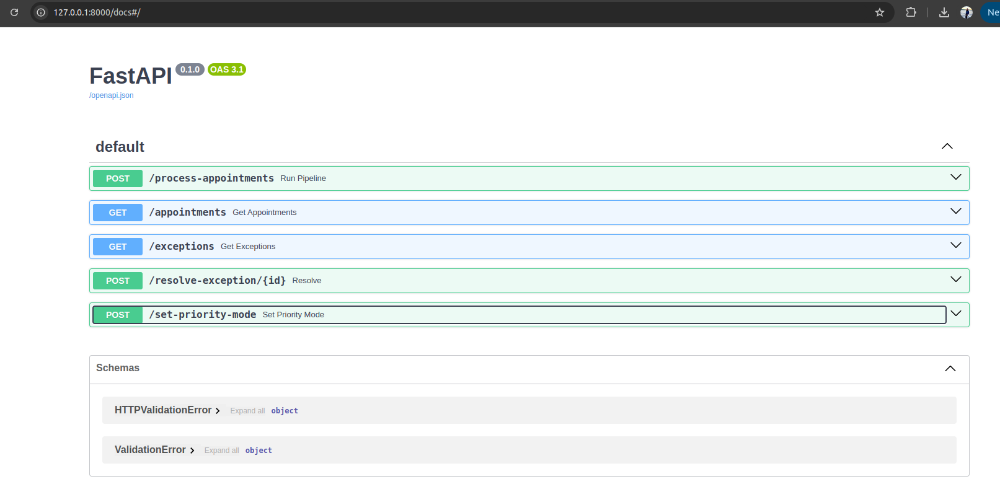
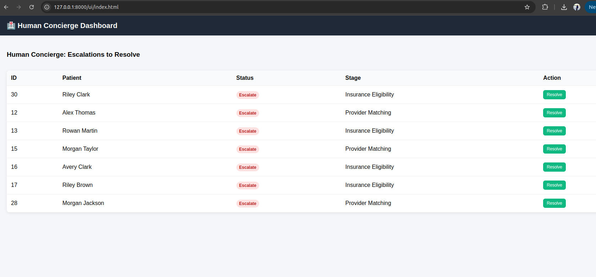
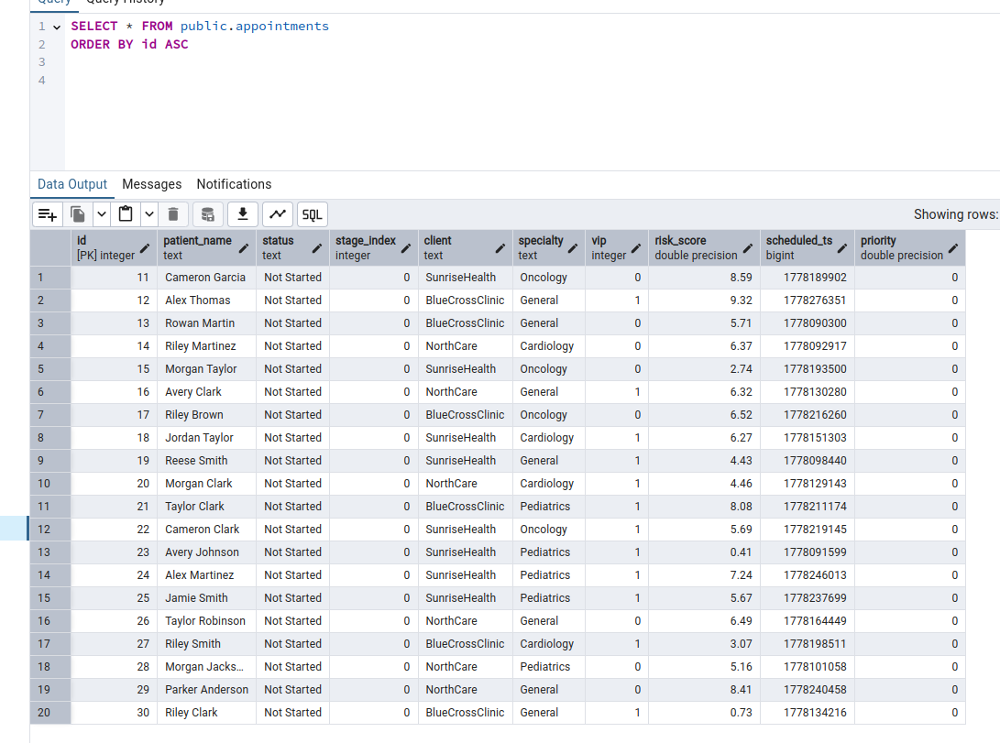

This is a take-home assignment I received as a part of a free non-NDA interview for a healthcare company

# Problem Statement: Agentic Workflow Management System (Medical Appointments)

A lightweight agentic orchestration system that processes medical appointments through multiple intelligent stages, supports dynamic prioritization (heuristic + LLM-ready), and enables human-in-the-loop exception handling via a concierge UI.

## Core Product Requirements

*Intelligent Orchestrator:* A master agent that ingests a feed of appointments from a database. It must intelligently decide which appointments to process first based on dynamic priorities (which may vary by client, specialty, or other unknown factors).

*Agentic Processing:* Appointments go through a configurable number of processing stages (e.g., 6 stages). Each stage should be conceptualized as an individual agent.

*Standardized Outputs:* Each processing stage must return one of four states: Not Started, Processing, Complete, or Escalate.

*The Exception Queue:* If an agent returns Escalate, the appointment must be routed to a human-in-the-loop Exception Queue.

*Human Concierge Resolution:* A human user must be able to interact with the Exception Queue to unblock the issue. Once resolved, the system should immediately update the appointment status to Cleared and resume workflow if necessary.

## Solution Design:
I built a lightweight system for medical appointment processing, where each appointment flows through a 6-stage pipeline (Intake, Insurance check, Clinical pre-check, Provider Matching, Outreach, and Final confirmation).
The system includes a dynamic priority engine that ranks appointments based on factors like VIP status, risk score, specialty, client type, and time sensitivity (with both rule-based and LLM-ready design).

Appointments are processed by an orchestrator that executes stages sequentially, and any failures or edge cases are routed to a human-in-the-loop exception queue (Human Concierge) for resolution via UI or API.

## Backend endpoints:
```
POST /run-pipeline → triggers workflow execution
GET /appointments → fetch all appointments with current stage + status
GET /exceptions → view escalated cases
POST /resolve/{id} → resolve and resume workflow
POST /appointments → add new appointments (raw data)
```

The design focuses on clear separation of concerns, extensibility for LLM-based decision making, and a realistic simulation of healthcare workflow orchestration systems.

Adding screenshots of my FastAPI backend.



This is how my basic Human concierge UI would look like, where a human-in-the-loop would resolve in case an appointment is stuck in any stage



This is how my basic database table in PostgreSQL looks:




# System Overview

Appointments (Postgres DB)  
→ Priority Engine (rule-based / LLM-ready scoring)  
→ Orchestrator (priority-based execution)  
→ 6 Agentic Stages  
→ Exception Queue (Escalations)  
→ Human Concierge Resolution (API + UI)

---

# Features

- 6-stage agentic workflow pipeline
- Dynamic priority scoring (heuristic + optional LLM)
- PostgreSQL-backed persistence
- Exception queue for escalations
- Human concierge resolution via API + UI
- FastAPI backend
- Simple web UI dashboard

---

# Project Structure

agentic_workflow/

app/
- api.py (FastAPI endpoints)
- facade.py (system entry layer)

domain/
- models.py (Appointment, Status, AppointmentStage)
- orchestrator.py (workflow engine)
- priority_engine.py (scoring logic)

infrastructure/db/
- models.py (SQLAlchemy ORM)
- connection.py (DB setup)
- appointment_repo.py

scripts/
- add_appointments.py (mock data generator)

ui/
- index.html (exception dashboard)

.env
requirements.txt

---

# Setup Instructions

## 1. Clone repository

git clone <repo_url>
cd agentic_workflow

---

## 2. Create virtual environment

python -m venv .venv  
source .venv/bin/activate   (Mac/Linux)  
.venv\Scripts\activate      (Windows)

---

## 3. Install dependencies

pip install fastapi uvicorn sqlalchemy psycopg2-binary python-dotenv

---

## 4. Configure environment variables (.env)

DB_USER=postgres  
DB_PASSWORD=password  
DB_HOST=localhost  
DB_PORT=5432  
DB_NAME=appointments_db  

---

## 5. Create database

CREATE DATABASE appointments_db;

---

## 6. Create table

CREATE TABLE appointments (
    id SERIAL PRIMARY KEY,
    patient_name TEXT,
    status TEXT,
    stage_index INT DEFAULT 0,

    client TEXT,
    specialty TEXT,
    vip INT DEFAULT 0,
    risk_score FLOAT DEFAULT 0,
    scheduled_ts BIGINT,

    priority FLOAT DEFAULT 0
);

---

# How to Run

## Step 1: Generate sample data

python scripts/add_appointments.py

---

## Step 2: Start backend

uvicorn app.api:app --reload

Server runs at:
http://127.0.0.1:8000

---

## Step 3: Open UI

http://127.0.0.1:8000/ui/index.html

---

## Step 4: Run pipeline

POST /run-pipeline

---

## Step 5: View data

GET /appointments  
GET /exceptions  

---

## Step 6: Resolve exception

POST /resolve/{id}

---

# Key Design Decisions

Priority is computed at runtime, not stored as source of truth in DB.  
DB stores only raw appointment metadata.  

Orchestrator executes workflow based on computed priority.  

Human-in-the-loop system handles escalations via UI/API.  

Clear separation of concerns:
- PriorityEngine → scoring
- Orchestrator → execution
- API → interface
- UI → human resolution

---

# Workflow Example

1. Insert appointments  
2. Run pipeline  
3. Priority engine ranks dynamically  
4. Agents process 6 stages  
5. Some escalate  
6. Human resolves via UI  
7. Workflow resumes  

---

# Important Notes

- /appointments is read-only
- /run-pipeline triggers state changes
- priority is not persisted as source of truth
- system recomputes priority dynamically

---

# Future Enhancements

- LLM tool-calling prioritization
- Real-time WebSocket UI updates
- Retry + compensation workflows
- Event-driven architecture (Kafka/RabbitMQ)
- Audit logs per stage
- Learning-based prioritization

---

# Quick Start

python scripts/add_appointments.py  
uvicorn app.api:app --reload  
POST /run-pipeline  
open http://127.0.0.1:8000/ui/index.html
